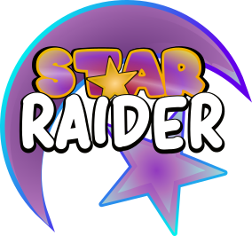

# 

A Roguelike set within a meta-dimension where stars of the universe are herded like sheep through the waters of time. This flow of time sprouts from the many springs that cover the surface of this plane. Eternia, land of the eternal fire and the time waters. Home of the star herders who wander her surface with their great flocks, and who's star dust is the envy of the rest of the universe. Magical and lifegiving, only the mysterious herders know all its secrets. Stars float in the flow of waters eternal, giver and taker of life. May the taste of time never leave your lips. 
